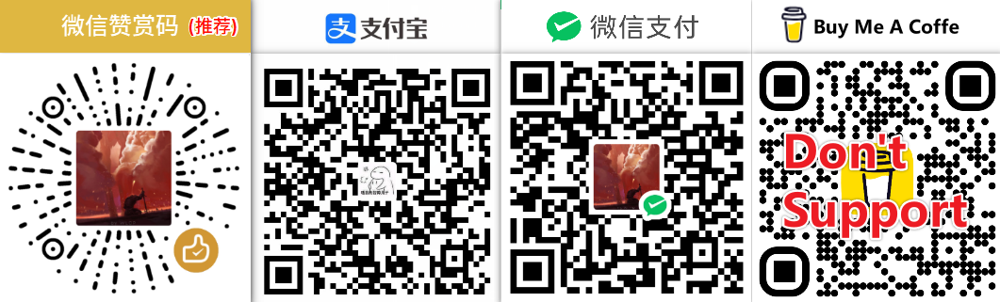

## Hello Github Fans 👋

Welcome to my personal website: [LincZero.github.io](https://linczero.github.io/), this site has a lot of technical notes that I wrote.

- 📫 I'm a full stack developer. For more details about the development, see the Profile section of my personal website.
- 🌱 Currently working in Guangdong China

<td></td>

<table>
  <tbody>
    <tr>
      <td></td>
      <td>
        
         
        (Without C++ version)
      </td>
    </tr>
  </tbody>
</table>

  
Organizational statistical problem

  <!-- https://github-readme-stats.vercel.app/api? &theme=onedark&locale=en -->
  
  Warning: Individuals work mostly in organizations, such as [any-block](https://github.com/any-block) . And github-readme-stats cards [do not support statistics from organizations](https://github.com/anuraghazra/github-readme-stats/issues/1) , so I used [another branch with the warehouse](https://github.com/anuraghazra/github-readme-stats/pull/2459)
  
  注意：个人大部分工作迁移到组织中便于管理，如 [any-block](https://github.com/any-block)。而github-readme-stats卡片[并不支持从组织中进行统计](https://github.com/anuraghazra/github-readme-stats/issues/1)，所以我使用了[另一分支与仓库](https://github.com/anuraghazra/github-readme-stats/pull/2459)

## Open source project (Chief creator)

主创开源项目（注意，其中很多项目被我迁移到了organization中。如果你想了解更多，不妨到这些组织仓库里看看） 
（Note that many of these projects were migrated to my organization. If you want to learn more, check out these organizational warehouses）

[My open Source Project Navigation | 我的开源项目导航](https://linczero.github.io/MdNote_Public/ProductDoc/)

## Thank you very much for your support

感谢您的支持! 支持支付宝, 微信, Paypal, ~~BuyMeACoffee~~. 最好备注你所支持的github项目以及github名 
Support using Alipay, Wechat, Paypal, ~~BuyMeACoffee~~. It is best to fill in the reason note when sponsoring and github account name. [Support List](./Sponsors.md)

<!-- <table>
  <tbody>
    <tr>
      <th style="padding:0">
        
      </th>
      <th style="padding:0">
        
      </th>
      <th style="padding:0">
        
      </th>
    </tr>
  </tbody>
</table> -->

<!-- img width="100%" alt="pay by zfb/wechat/buy me a coffe" src="https://github.com/LincZero/LincZero/blob/main/assets/pay_all2.png" /-->
<!-- https://ghproxy.com/https://raw.githubusercontent.com/LincZero/LincZero/main/assets/zfb_wechat_pay.png -->

<table width="100%">
  <tbody>
    <tr>
      <td>______________________________________________</td>
      <td>______________________________________________</td>
    </tr>
    <tr>
    <td>
      
    </td>
    <td>
      <a alt="buymeacoffee" href="https://www.buymeacoffee.com/762699299O_doNotPay">
        
        <!--  -->
      </a>
    </td>
    </tr>
  </tbody>
</table>

